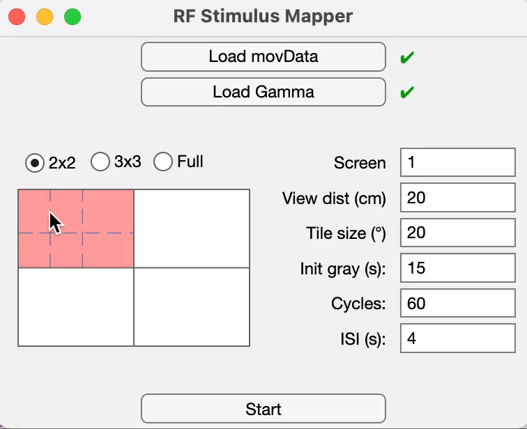

# Receptive Field (RF) Stimulus Hub

[](https://www.mathworks.com/products/matlab.html)

A MATLAB application for mapping receptive fields in neurons. Allows users to select one or more quadrants for focused RF mapping and to further subdivide those quadrants into finer grids to probe RF structure. Supports default dense noise stimuli and allows loading of custom patterns, sparse noise, or natural scenes. Includes an interactive interface offering real-time previews and intuitive mouse-based region selection to streamline experiment setup and execution.

---

## Demo

Tiles are numbered in row-major order from top-left to bottom-right. 



Output is a .csv file with five columns:
1. Tile index presented
2. Tile row number (left to right)
3. Tile column number (top to bottom)
4. X coordinate: horizontal center of that tile (can be fed into VisionGUI)
5. Y coordinate: vertical center of that tile (can be fed into VisionGUI)

---

## Requirements

* **MATLAB R2023a**. App created and tested with this MATLAB version. Older versions may be incompatible.
* **App Designer**. Required if modifying `.mlapp`.
* **Psychtoolbox**
* **Image Processing Toolbox**
 
**Recommended:** Dual-monitor setup (one for stimulus, one for control). If using a single monitor, check that screenNumber is set to 0 on macOS or 1 on Windows.

---

## Repository Structure

```plaintext
rf-stimulus-hub/            # Repository root
├── RFStimGUI.mlapp       # App Designer GUI
├── playRFStim.m          # Core stimulus-presentation routine
├── deg2px.m              # Converts degrees → pixels
├── computeRegionRect.m   # Defines named screen-region rectangles
├── computeGridRegionPx.m # Computes tile/mask pixel coordinates
├── checkEscape.m         # Monitors ESC key for safe abort
└── README.md             # This file
```

---

## Quick Start

### Launch GUI

```matlab
RFStimGUI
```

1. **Load Movie & Gamma Table**: The app includes a default `rfMovie.mat` (dense noise stimulus) and a `NormGamTab_20250129.mat`. You can either:

   * Click **Load Movie** to upload your own stimulus movie (`.mat` with a 3‑D array) or use the provided default.
   * Click **Load Gamma Table** to upload your monitor’s gamma calibration (`.mat`), or use the provided default.
2. **Configure Parameters**:

   * Quadrant(s) selected from 2×2, 3×3, or full
   * Viewing distance (cm)
   * Tile size (deg)
   * Initial gray screen duration (s)
   * Inter-stimulus interval (s)
   * Number of cycles
3. **Preview**: Click on the preview area to verify region selection.
4. **Start**: Click **Start** to run the RF mapping stimulus. Press **Esc** during any stimulus presentation to abort safely.

---

### Command‐Line Usage

```matlab
playRFStim( ...
    rfMovie,             ... % movData: 3-D stimulus 
    20,                  ... % tileDeg (deg)
    1,                   ... % durInitGray (s)
    2,                   ... % nCycle
    4,                   ... % isi (s)
    'regionOpt', 'full',  ... % region selection
    'viewingDistanceCm', 20,... % viewing distance
    'screenNumber', 0);        ... % display screen index
```

---

## Function Reference

* **playRFStim.m**: Main loop—renders frames (with gamma correction), unmasks tiles, logs events, enforces timings.
* **deg2px.m**: `px = deg2px(deg, distCm, screenWidthPx, screenWidthCm)`.
* **computeRegionRect.m**: Returns `[x y w h]` for regions (`'full', 'tl', 'br', etc.`).
* **computeGridRegionPx.m**: Calculates pixel rectangles for each tile and mask within a region.
* **checkEscape.m**: Polls for ESC key to terminate stimulus presentation safely.

---

## Future Support

* **Non‑contiguous region selection**: Arbitrary quadrant combinations.
* **Global abort**: ESC works even when GUI is unfocused.
* **Standalone compilation**: Run GUI without MATLAB.

---

© 2025 Victoria Fan, Higley Lab, Yale School of Medicine
